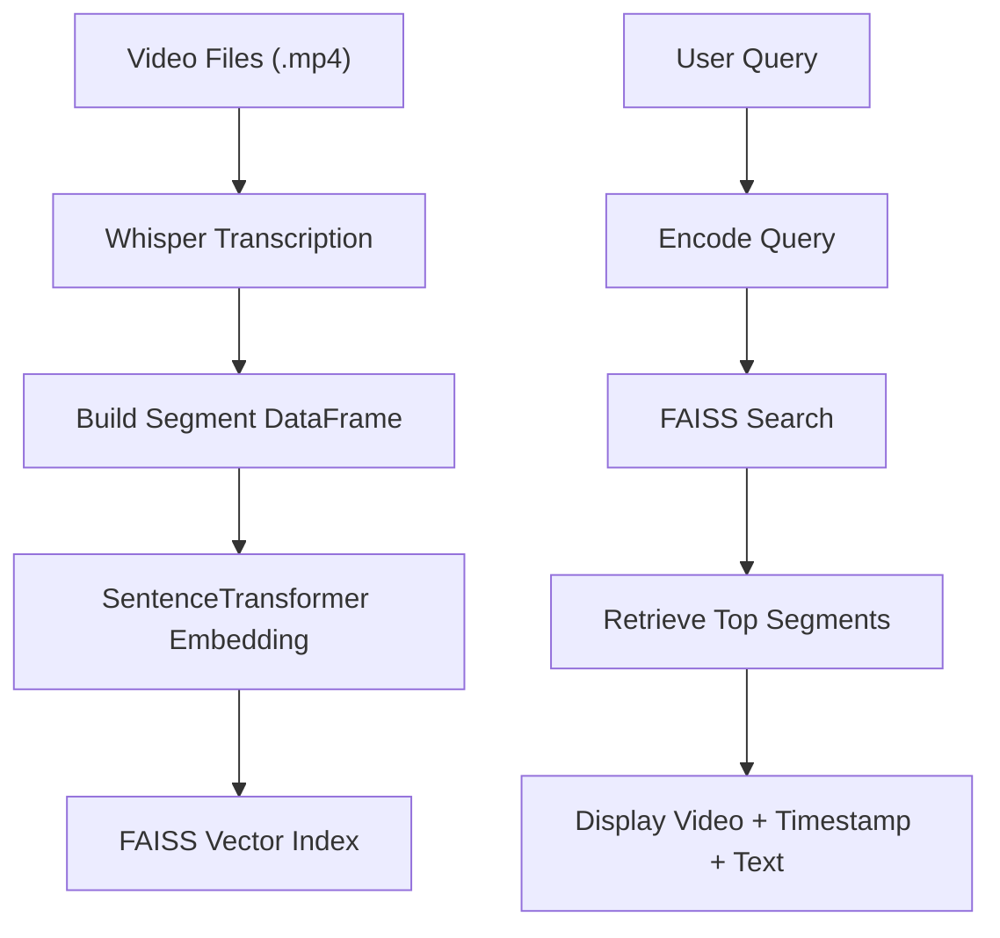

# 📹 AI-Powered Video Search Engine

> **"Ask a question and instantly find where in your videos it's answered."**

---

## ✨ Overview

This project builds a local AI-powered semantic search engine over your `.mp4` video files. It uses OpenAI's Whisper for transcription, Sentence Transformers for semantic search, and FAISS for fast indexing.

Optimized to run on **NVIDIA RTX 5060 GPUs**, it leverages GPU acceleration for massive performance improvements.

---

## ⚡ GPU-Accelerated Components

This application is optimized to run the heavy workloads on GPU via CUDA. Here's how:

- **Whisper Transcription (Speech-to-Text)**
  - GPU-accelerated for faster audio-to-text processing.
- **Sentence Transformer Embeddings (Text-to-Vector)**
  - GPU used to convert transcript sentences into numerical meaning.
- **Query Embedding (Search)**
  - GPU used again to convert user query into vector for comparison.

The FAISS index runs on **CPU** for compatibility on Windows.

---

## 🧰 Full Installation Guide

Follow these steps **in order** to set up everything from scratch on a Windows machine with NVIDIA RTX 5060:

### 1. Install [Python 3.10+](https://www.python.org/downloads/)

- Make sure to check "Add Python to PATH" during installation.

### 2. Install [Miniconda](https://docs.conda.io/en/latest/miniconda.html) or [Anaconda](https://www.anaconda.com/products/distribution)

### 3. Create a Conda Environment

```bash
conda create -n vidsrch python=3.10 -y
conda activate vidsrch
```

### 4. Install NVIDIA CUDA Toolkit 12.9

- Visit: [https://developer.nvidia.com/cuda-downloads](https://developer.nvidia.com/cuda-downloads)
- Select your OS & download CUDA 12.9 for Windows.

### 5. Install NVIDIA cuDNN (Optional)

- Visit: [https://developer.nvidia.com/cudnn](https://developer.nvidia.com/cudnn)
- Required only if you plan to fine-tune or run at full speed.

### 6. Install FFmpeg (Video Processing)

#### Option A: Manual

- Download from: [https://www.gyan.dev/ffmpeg/builds/](https://www.gyan.dev/ffmpeg/builds/)
- Extract and add `bin/` to your system PATH

#### Option B: Via Chocolatey (if installed)

```bash
choco install ffmpeg
```

---

## 🚀 Project Setup

### 1. Clone the Repository

```bash
git clone https://github.com/Raykarr/AI-Powered-Video-Search-Engine
cd [AI-Powered-Video-Search-Engine]
```

### 2. Install Python Dependencies

```bash
pip install --upgrade pip
pip install -r requirements.txt
```

If using the latest PyTorch nightly for CUDA 12.9:

```bash
pip install --pre torch torchvision torchaudio --index-url https://download.pytorch.org/whl/nightly/cu129
```

---

## 🔄 Run the App

### Step 1: Place `.mp4` files in the root project folder

### Step 2: Run the Script

```bash
python app.py
```

### Step 3: Enter Questions in Console

```text
Enter your search query (or type 'exit' to quit):
> what is the theory of motivation?
```

You will get output like:

```
🏆 Result #1
🎮 Video: lecture1.mp4
🕒 Timestamp: 00:12:45
📝 "...so Maslow's hierarchy is one of the most influential..."
```

---

## 📊 Architecture Flowchart (Mermaid)



---

## 📂 Future Improvements

- ✅ Add GUI (Streamlit or Gradio)
- ✅ Save transcripts to file (CSV/JSON)
- ⏳ Support FAISS-GPU indexing (Linux)
- 📍 Subtitle overlay in video
- 🌐 Web deployment option

---

## 📄 Requirements File

Create a file called `requirements.txt` and paste the following:

```txt
# Core Libraries
numpy
pandas
tqdm

# Whisper (for transcription)
git+https://github.com/openai/whisper.git

# Sentence Transformers
sentence-transformers

# FAISS (CPU version, compatible with Windows)
faiss-cpu

# Torch (Install based on your CUDA version, see README for alternatives)
torch
torchaudio
torchvision

# For audio processing (used by whisper)
ffmpeg-python
```

---

## 🌟 Credits

- Whisper by OpenAI
- SentenceTransformers by UKPLab
- FAISS by Facebook AI
- TQDM, NumPy, Pandas

---

## 🌐 License

MIT License. Use and modify freely. Credit appreciated.

---


